```{css, echo=FALSE}
.scrollChunk {
  max-height: 450px;
  overflow-y: auto;
  background-color: inherit;
}

.cite {
position: absolute; 
bottom: 0; 
right: 0;
}
```

```{r setup, include=FALSE, message = FALSE, warning=FALSE}
options(htmltools.dir.version = FALSE)
# library(fontawesome)

################
# Packages
################
# if packages are not already installed, the function will install and activate them
usePackage <- function(p) {
  if (!is.element(p, installed.packages()[,1]))
    install.packages(p, dep = TRUE)
  require(p, character.only = TRUE)
}

usePackage("stargazer") # create tables

usePackage("tidyverse")

usePackage("DT")

usePackage("RefManageR")

usePackage("meta")

usePackage("lsa")

usePackage("mvtnorm")


################
# Data Bib file
################
BibOptions(check.entries = FALSE, bib.style = "authoryear", style = "markdown",
           dashed = TRUE, longnamesfirst=FALSE, max.names=1)
# file.name <- system.file("Bib", "biblatexExamples.bib", package = "RefManageR")
file.name <- "LibrarySubset_Basel.bib"
bib <- ReadBib(file.name)
```


<!-- *********** NEW SLIDE ************** -->

## Table of Contents

Three parts:

1 Motivation
  + about me
  + emerging technologies
    + ethics in real time 
  
2 Developed tools
  + Cognitive-Affective Maps
  + Empirical Ethics Scale for Technology Assessment (probably skipped)

3 Empirical Results
  


<br>
 
.pull-left[
if you want to download the slides / R Code: https://github.com/FennStatistics/Talk_Basel_EP_PSBC_lab
]

.pull-right[

<center>

</center>

]


<!-- *********** HEADING ************** -->
---
class: heading,middle


Part 1: Motivation


<!-- *********** HEADING ************** -->
---
class: heading,middle


about me


<!-- *********** NEW SLIDE ************** -->
---
## About me


.pull-left[

* Bachelor in psychology, master in applied statistics
* worked as a "coach for data analysis" 
* taught myself (a little) web development
* had already 2 desk rejects, and EU proposal was rejected (450.000,-)
* Member of two research groups (and hopefully Basel soon!):

]

.pull-right[

<center>

</center>

]


.pull-left[
PhD candidate in "Statistical Modeling in Psychology"

<center>

</center>

]

.pull-right[
associated member in "Cluster of Excellence Living, Adaptive and Energy-autonomous Materials Systems" in Freiburg

<center>
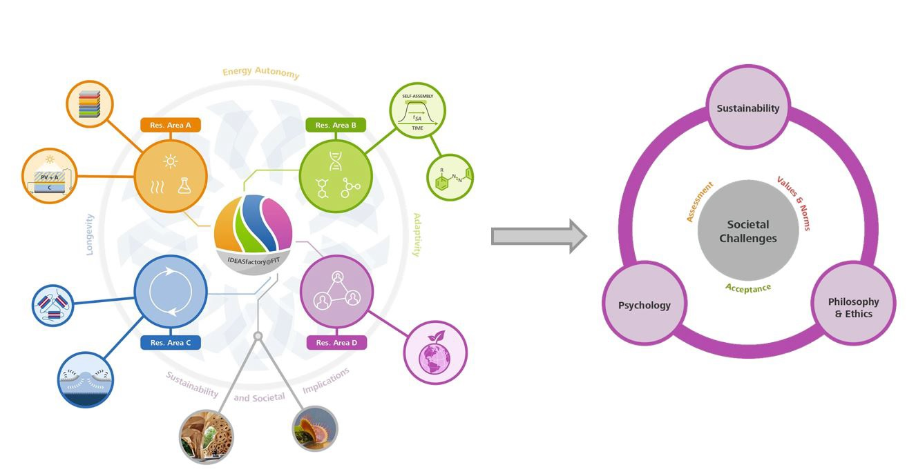
</center>

]


<!-- *********** NEW SLIDE ************** -->
---
## The elephant in the room


.pull-left[
speech of António Guterres at the 2022 United Nations Climate Change Conference (COP 27):

> We are in the fight of our lives. 
And we are losing. 
Greenhouse gas emissions keep growing.   
Global temperatures keep rising.  
And our planet is fast approaching tipping points that will make climate chaos irreversible.
We are on a highway to climate hell with our foot still on the accelerator.  

<br>
see talk: https://www.youtube.com/watch?v=J3UdNagA31w
]

.pull-right[

Observational data - he seems right: 

monthly mean carbon dioxide measured at Mauna Loa Observatory, Hawaii: 


<center>
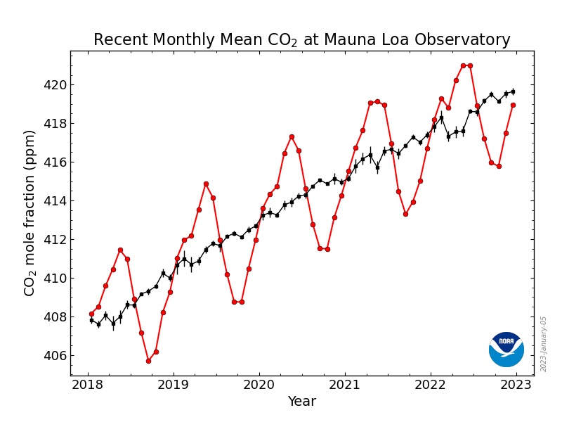
</center>

data collection started 1958: https://gml.noaa.gov/ccgg/trends/mlo.html

]


<!-- *********** NEW SLIDE ************** -->
---
## Neural networks trained on multiple climate model output

*When will we reach the 1.5◦C global warming threshold?* 


<center>

</center>

> Global warming forecasts are sensitive to the assumed climate model (rows) and emission
scenario (groups of rows)


`r Citet(bib, c("diffenbaughDatadrivenPredictionsTime2023", "elsemullerSensitivityAwareAmortizedBayesian2023"))`; computed by https://bayesflow.org/


<!-- *********** NEW SLIDE ************** -->
---
## solution (?!): a high-technology portfolio


.pull-left[

> A daunting task lies ahead for scientists and engineers to guide society towards environmentally sustainable management during the era of the Anthropocene. This will require appropriate human behaviour at all scales, and may well **involve internationally accepted, large-scale geo-engineering projects**, for instance to ‘optimize’ climate.

by `r Citet(bib, c("crutzen_geology_2002"))`
]

.pull-right[
<center>
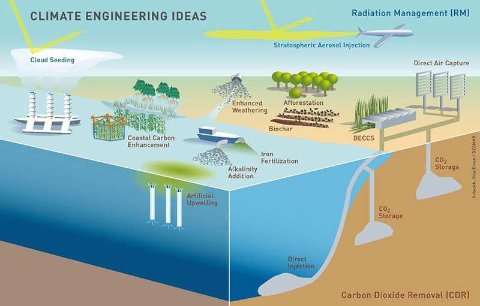
</center>
]

<br>
-> huge investments by private and public sector, e.g. [Office of Fossil Energy and Carbon Management investing $2.52 billion to fund two carbon capture programs ](https://content.govdelivery.com/accounts/USDOEOFE/bulletins/3454f32)

> **ethical assessment of such emerging technologies in real-time**, see also talk the [Ten Domains of Climate Ethics by Konrad Ott](https://www.youtube.com/watch?v=SJ0saECi1Qc)


<!-- *********** NEW SLIDE ************** -->
---
## ethical assessment in real-time


.pull-left[

**Problem**:

> It is repeatedly noted with scepticism that the speed of technological innovation on a global scale means that ethics is often powerless to keep up with technological developments and has the character of a "bicycle brake on an intercontinental aircraft"

by `r Citet(bib, c("grunwaldHandbuchTechnikethik2021"))`

<br>
* post-normal science in contrast to applied science e.g. `r Citet(bib, c("funtowiczSciencePostnormalAge1993"))`
* deep uncertainty e.g. `r Citet(bib, c("marchauDecisionMakingDeep2019"))`
* ...

]

.pull-right[

**Possible Solution**:

> the best way to reduce uncertainty about the future of open systems is to make informed but incremental decisions and then see what happens

> preparation for and resilience in the face of an unpredictable future is a core asset of any well-functioning society

by `r Citet(bib, c("gustonRealtimeTechnologyAssessment2002"))`

<br>
* enable empirical informed ethics e.g. `r Citet(bib, c("fennDevelopmentValidationEmpirical2023", "reijersMethodsPractisingEthics2018"))`
* anticipatory governance e.g. `r Citet(bib, c("foleyAnticipatoryGovernanceGeoengineering2018"))`
* ...

]


<!-- *********** HEADING ************** -->
---
class: heading,middle


emerging technologies


<!-- *********** NEW SLIDE ************** -->
---
## Maturity of technologies

**Technology readiness level**

.pull-left[

<center>

</center>

]

.pull-right[

**Three examples**:


* TRL 1: Technology Research – Basic principles observed and reported
* TRL 5: Conceptual Design and Prototype Demonstration
* TRL 10: Proven Operations

**Technology assessment**:
* ex ante: methods aiming at technology assessment at an early stage of the research and innovation process; TRL 1-3
* intra: methods aiming at technology assessment during design and testing stage; TRL 4-8
* ex post: methods aiming at technology assessment when research and innovation process is already finished and concrete technologies have been developed; TRL 9-10
]


TRL: `r Citet(bib, c("straubSearchTechnologyReadiness2015", "vikBalancedReadinessLevel2021"))` and methods: `r Citet(bib, c("reijersMethodsPractisingEthics2018"))`


<!-- *********** NEW SLIDE ************** -->
---
## Researching emerging technologies

**Collingridge dilemma**

<center>

</center>


`r Citet(bib, c("collingridgeSocialControlTechnology1980", "davisPreprototypeUserAcceptance2004", "mollerProspectiveTechnologyAssessment2022"))`


<!-- *********** NEW SLIDE ************** -->
---
## Methods for (prospective) technology assessment

possible definition: 

> research practice motivated through reflexive knowledge gain for the scientific analysis of dynamic and complex socio-technical configurations with the intention of advising


<br>
<br>
**4 fundamental approaches:**

* *classical technology assessment*: top-down, centralized approach, from experts to laypersons, aiming to predict unplanned, unanticipated negative effects after introducing an emerging technology
* *participatory technology assessment*: include the perspective of laypersons 
* *argumentative technology assessment*: focuses on the ongoing process of democratic debate and argumentation
* *constructive technology assessment*: assists the development and design of technologies while technologies are still developed


<br>
<br>
<br>
<br>
`r Citet(bib, c("boeschenTechnikfolgenabschaetzungHandbuchFuer2021", "grunwaldTechnikfolgenabschaetzungEinfuehrung2022"))`; see [summary of methods for (prospective) TA](https://tinyurl.com/28a6j88w)


<!-- *********** HEADING ************** -->
---
class: heading,middle


Part 1: Developed tools


<!-- *********** NEW SLIDE ************** -->
---
## Overview

in `r Citet(bib, c("fennDatadrivenMultiMethodApproachIdentifying2023"))` proposed a **multi-method-approach** to combine heterogeneous sources of data to identify ethical 
concerns of laypersons


<center>

</center>


<!-- *********** HEADING ************** -->
---
class: heading,middle


Cognitive-Affective Maps


<!-- *********** NEW SLIDE ************** -->
---
## Cognitive-Affective Maps

CAMs as a quantitative and qualitative research method first became popular through [Paul Thagard](https://paulthagard.com/); possible to identify and visually represent any kind of declarative knowledge:


<center>

</center>


`r Citet(bib, c("sendtner_kostbare_2021"))`; developed tools `r Citet(bib, c("fennCognitiveAffectiveMaps2023"))` motivated by `r Citet(bib, c("reuterBridgingTroubledWaters2022", "thagard_empathica_2010"))`


<!-- *********** NEW SLIDE ************** -->
---
## Cognitive-Affective Maps - theory

**What are CAMs?**

* CAMs are „conceptual structures that people use to represent important aspects of the world“
* „cognitive-affective map is a visual representation of the emotion values of a group of interconnected concepts“
  + this is how CAMs differ from semantic networks, because CAMs additionally contain emotions (valence)
  + hot cognition: emotions cannot be separated from cognitions
  
<br>
<br> 

**How are CAMs constructed?**

* the stepwise construction process of CAMs can be understood as a **multiple constraint satisfaction process**, where concepts, conditions, goals, etc. are mentally represented with the involvement of emotions
  + Concepts in the CAM are only changed or added if they correspond to the „most coherent account of what we want to understand“

<br>

`r Citet(bib, c("thagard_coherence_2000", "thagard_hot_2006", "thagard_cognitive_2021"))`


<!-- *********** NEW SLIDE ************** -->
---
## Cognitive-Affective Maps - fundamental hypothesis 

**Hypothesis**: The generation process of CAMs is not arbitrary, but is determined by multiple processes at multiple levels, and thus CAMs from similar individuals on an identical topic exhibit systematic correlations (similar data generating process)

* can be presented by a „emergent product of interaction between networks of mental representations at the individual level and networks of social communication at the group level“


<center>
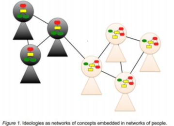
</center>


> if stochasticity is ubiquitous in **complex networks**, these networks are not maximally random either; rather, they obey organization principles that make them functional


`r Citet(bib, c("bianconi_multilayer_2018", "homer-dixon_complex_2013"))`


<!-- *********** NEW SLIDE ************** -->
---
## Cognitive-Affective Maps - application cases

* within conceptual / qualitative studies, CAMs have been applied to depict political ideologies
*	to support conflict resolution
* to inform international climate politics
*	in quantitative studies, CAMs were used to investigate the perception of the Covid-19 pandemic
*	using a mix of qualitative and quantitative procedures, CAMs have been applied to measure the perception of emerging technologies or the success of an intervention in early child-care institutions
*	CAMs have been used in the context of agent-based modeling (Schröder & Wolf, 2017; Wolf et al., 2015)
* ...


<br>
<br>
<br>
see two sections of CAM tools online documentation: [Additional Resources](https://camtools-documentation.readthedocs.io/en/master/Additional%20Resources/); [What are the advantages of using Cognitive-Affective Maps?](https://camtools-documentation.readthedocs.io/en/master/Cognitive-Affective%20Maps/#what-are-the-advantages-of-using-cognitive-affective-maps)


<!-- *********** NEW SLIDE ************** -->
---
## example - study design


.pull-left[

**starting CAM**
<center>

</center>

]

.pull-right[

**example given to participants**
<center>

</center>

]


for more details you could read the online documentation: https://osf.io/q5hj4/


<!-- *********** NEW SLIDE ************** -->
---
## example - resulting CAMs


.pull-left[

**the expected**
<center>
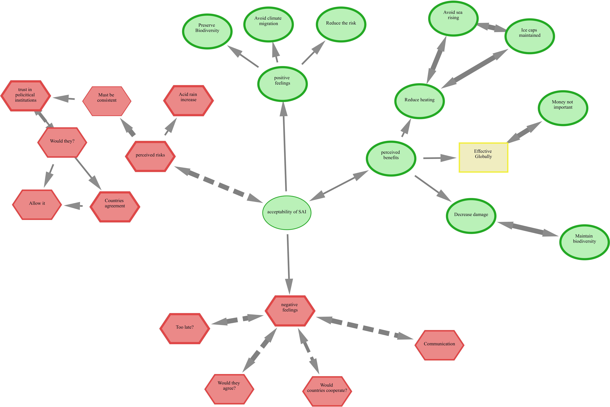
</center>

]

.pull-right[

**the outlier**
<center>
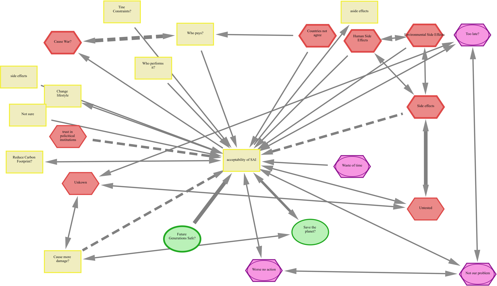
</center>

]


if you want to try out the study: https://studien.psychologie.uni-freiburg.de/publix/qDU7aBJyuQz?PROLIFIC_PID=testerID 

<!-- *********** NEW SLIDE ************** -->
---
## data collection - C.A.M.E.L.

we (Julius & Florian) developed **Cognitive-Affective Map Extended Logic** (C.A.M.E.L.) , which is an open-source software to draw Cognitive Affective Maps. It aims to offer people an easy and intuitive interface on which they could design mind map that can be analysed by researchers


.pull-left[
*researcher view*

<center>
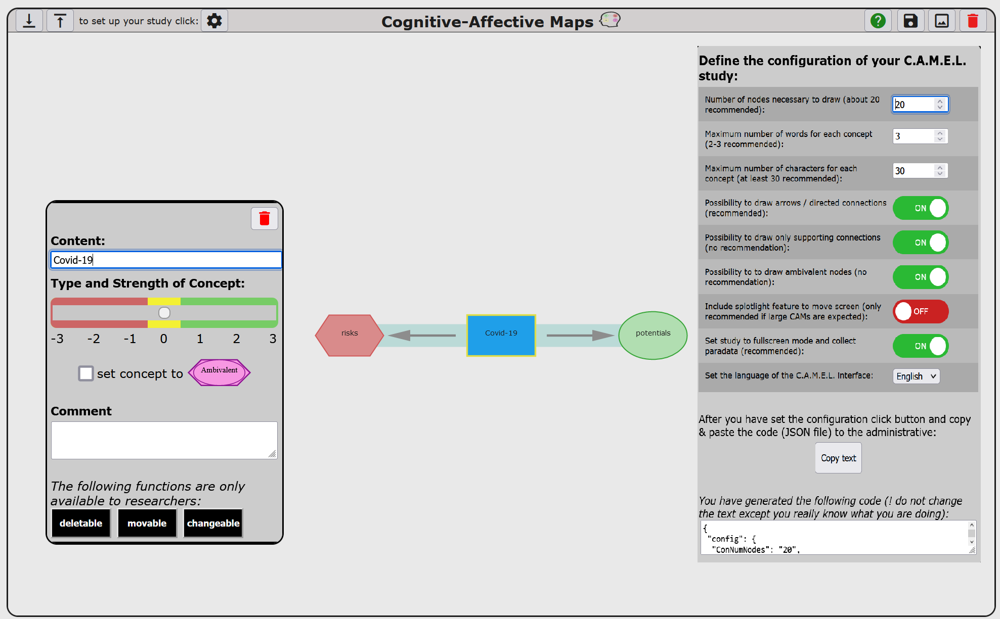
</center>

]

.pull-right[
*participant view*

<center>

</center>

]

* possible to create, position and fix (i.e., impossibility to move a concept) elements
* switch languages
* enable / disable certain features


<!-- *********** NEW SLIDE ************** -->
---
## data collection - C.A.M.E.L.

.pull-left[
*researcher view*

<center>

</center>

]

.pull-right[
*possible options*

* possible to create, position and fix (i.e., impossibility to move a concept) elements
* switch languages
* enable / disable certain features

<br>
see in detail "[Define your config file](https://camtools-documentation.readthedocs.io/en/master/Cognitive-Affective%20Map%20extended%20logic/#define-your-config-file)" section in the online documentation
]

<br>
<br>
<br>
try it out: [maximum settings](https://camgalaxy.github.io/?cameraFeature=true&fullScreen=true&ShowResearcherButtons=true&hideArrows=false&hideAmbivalent=false&showSliderAgreementOnly=false); [minimal settings](https://camgalaxy.github.io/?cameraFeature=false&fullScreen=false&ShowResearcherButtons=false&hideArrows=true&hideAmbivalent=true&showSliderAgreementOnly=true)


<!-- *********** NEW SLIDE ************** -->
---
## data analysis - CAM-App

resulting data can be analyzed using our developed data-analysis tool **CAM-App**


.pull-left[

try it out
* online: https://fennapps.shinyapps.io/CAMtools_CAMapp/
* or better offline using your own computer: https://github.com/Camel-app/DataAnalysis

]

.pull-right[

<br>
<br>
<center>

</center>

]

* no coding is required to analyze resulting CAM data
  + facilitate the pre-processing of the data
  + analysis of pre-processed data


<!-- *********** NEW SLIDE ************** -->
---
## data analysis - CAM-App

logic of the CAM-App follows the principle of a classical data-analysis pipeline


.pull-left[

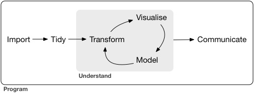

see: `r Citet(bib, c("peng_art_2016", "wickham_r_2017"))`

<br>
<br>
<br>

see in detail "[CAM-App](https://camtools-documentation.readthedocs.io/en/master/CAM-App/)" section in the online documentation
]

.pull-right[

composed of two steps:

**preprocessing step**: CAM data is often messy and the number of unique concepts drawn is in general quite huge, e.g.

*Following the five-step procedure, the 1063 unique concepts (1473 in total) were reduced to 52 concepts (see detailed list of the 52 concepts in Appendix E in the online supplementary; https://osf.io/vb5qe)* - see `r Citet(bib, c("fennIdentifyingKeypsychologicalFactors2023"))`

<br>
**analysis step**

* word lists
* aggregate CAM
* network indicators
* network similarity
* ...


]


<!-- *********** NEW SLIDE ************** -->
---
## Data structure of CAMs

assuming the **fundamental hypothesis** (see slide 18) is true, the generation process of CAMs is not arbitrary, but bey organization principles (which could depend on study design, ...) 

<br>
A CAM (graph) is in general defined by: 
$$ G = (V, E)$$
, whereby V = set of vertices, E = set of edges. The vertices also contain emotional information (valence; *hot cognition*, *HOTCO*, ...), which leads to the following network properties:


.pull-left[

**emotional properties**
<br>
measure how the valence of individual nodes contributes to the overall CAM (Average Valence, Percentage of each node type, <span style="color:blue">Central Node Valence</span>, ...)

]

.pull-right[

**latent properties**
<br>
refer to the number of nodes, links, and their interconnectedness (Centrality, Density, Diameter, Number of Nodes, Number of Links, Triadic Closure, ...)

]


<br>
using similar terminology as `r Citet(bib, c("mansell_novel_2021", "mansell_measuring_2021"))`


<!-- *********** NEW SLIDE ************** -->
---
## Data structure of CAMs - real time analysis

* **frontend**: visible content of the CAM is within a container for Scalable Vector Graphics
* **backend**: CAM itself as well as its concepts and connectors are Java Script classes, which define the structure for these objects
  + class definition respects the classical data model of networks; allows to use Java Script library [Cytoscape](https://js.cytoscape.org/)


<center>

</center>

> adaptive designs possible (provide fixed structure or manipulate the "Document Object Model")


<br>
if you want to try out a adaptive study: https://studien.psychologie.uni-freiburg.de/publix/gv3Q8UvdRLu


<!-- *********** NEW SLIDE ************** -->
---
## Overview


**Overview of the developed CAM tools** (linking everything)

<center>

</center>


<br>
central webpage (adminstrative panel): https://drawyourminds.de


<!-- *********** HEADING ************** -->
---
class: heading,middle


Empirical Ethics Scale for Technology Assessment (ESTA)


<!-- *********** NEW SLIDE ************** -->
---
## ESTA - 46 items, 6 dimensions


<center>

</center>


`r Citet(bib, c("fennDevelopmentValidationEmpirical2023"))`


<!-- *********** NEW SLIDE ************** -->
---
## ESTA - survey


.pull-left[

**Inform participants**

<br> 

<center>
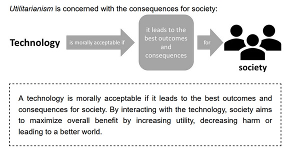
</center>

]

.pull-right[

**Subsequently answer scale**

<br> 

<center>
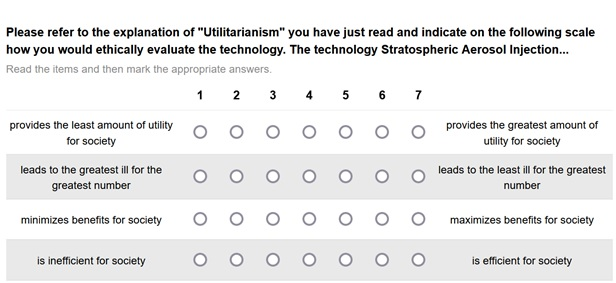
</center>

]


<!-- *********** NEW SLIDE ************** -->
---
## ESTA - dimensionality


.pull-left[

**Utilitarianism**

* technology is morally right if it leads to the greatest good for the greatest number
* degree of ethicalness depends on the perceived (possible) outcomes of the technology for all concerned - regardless of whether its "goodness" is equally distributed (criterion of impartiality)

<br>
<br>

**Hedonism**

* technology is morally right if it increases pleasure, well-being or promotes a good life of an individual agent, who is using the technology


]

.pull-right[

<center>
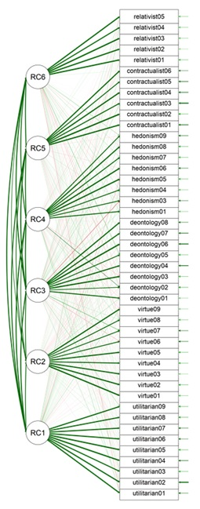
</center>

(defined a 6 factor solution)

]


<!-- *********** NEW SLIDE ************** -->
---
## ESTA - latent class analysis

**Virtue Ethics**: technology is morally right if it has been developed by someone who has the character and ability to recognize what is morally required


<center>
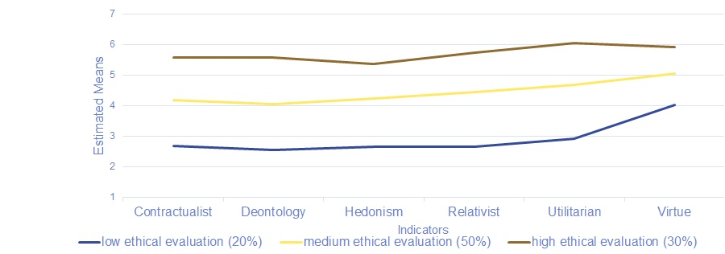
</center>


> virtue ethics was consistently evaluated higher


<!-- *********** HEADING ************** -->
---
class: heading,middle


Part 3: Empirical Results


<!-- *********** NEW SLIDE ************** -->
---
## aim of my two articles: 

1. Fenn, J., Helm, J. F., Höfele, P., Kulbe, L., Ernst, A., & Kiesel, A. (2023). Identifying key-psychological factors influencing the acceptance of yet emerging technologies–A multi-method-approach to inform climate policy. PLOS Climate, 2(6), 1–25. https://doi.org/10.1371/journal.pclm.0000207
2. Fenn, J., Gorki, M., Höfele, P., Estadieu, L., Becht, C., Kulbe, L., de Wall, M., Gekeler, J., & Kiesel, A. (2023). A Data-driven Multi-Method-Approach for Identifying Ethical Concerns of Emerging Technologies. [submitted manuscript]


<br>
<br>
* propose and implement **multi-method approaches to gather data on the acceptability and ethical concerns** of Stratospheric Aerosol Injection (SAI)
  + propose an integrative model to predict the acceptability of SAI,
  + whereby considering ethical concerns,
  + thereby acknowledge the significance of incorporating the perspectives of laypersons in the (ethical) assessment of climate engineering technologies in general


<!-- *********** NEW SLIDE ************** -->
---
## Stratospheric Aerosol Injection

**scenario-text approach**

.pull-left[

studying Stratospheric Aerosol Injection as an	use case of an emerging contested technology

<br>
<br>
working principle: reflect a small percentage of the solar radiation back into space before it reaches the earth

]

.pull-right[

<center>
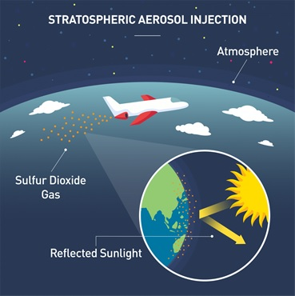
</center>


]

<br>
<br>
* “Congressionally-Mandated Report on Solar Radiation Modification” from the White House, see: https://www.whitehouse.gov/ostp/news-updates/2023/06/30/congressionally-mandated-report-on-solar-radiation-modification/
* “Questions and Answers on a new outlook on the climate and security nexus” from the European Commission, see: https://ec.europa.eu/commission/presscorner/detail/en/qanda_23_3525


<!-- *********** NEW SLIDE ************** -->
---
## integrative model - theory driven and empirical informed

**integrative model to predict SAI acceptability**


<center>

</center>


> based on the results in the step I procedure using “Cognitive-Affective Maps” measures for Climate Change Concern, Moral Hazard, and Tampering with Nature (highlighted in gray) were included


<!-- *********** NEW SLIDE ************** -->
---
## step I: Cognitive-Affective Maps

**aggregated CAM consisting of N =58 CAMs.**


<center>

</center>


PDF file to zoom in and out can be found on OSF (https://osf.io/jb3vk).

<!-- *********** NEW SLIDE ************** -->
---
## step II: estimate integrative model

**integrative model to predict SAI acceptability including tampering with nature**


<center>

</center>


<!-- *********** NEW SLIDE ************** -->
---
## Tampering with Nature


.pull-left[

**Items:**

<center>

</center>


]

.pull-right[

**scatter plot:**

<center>
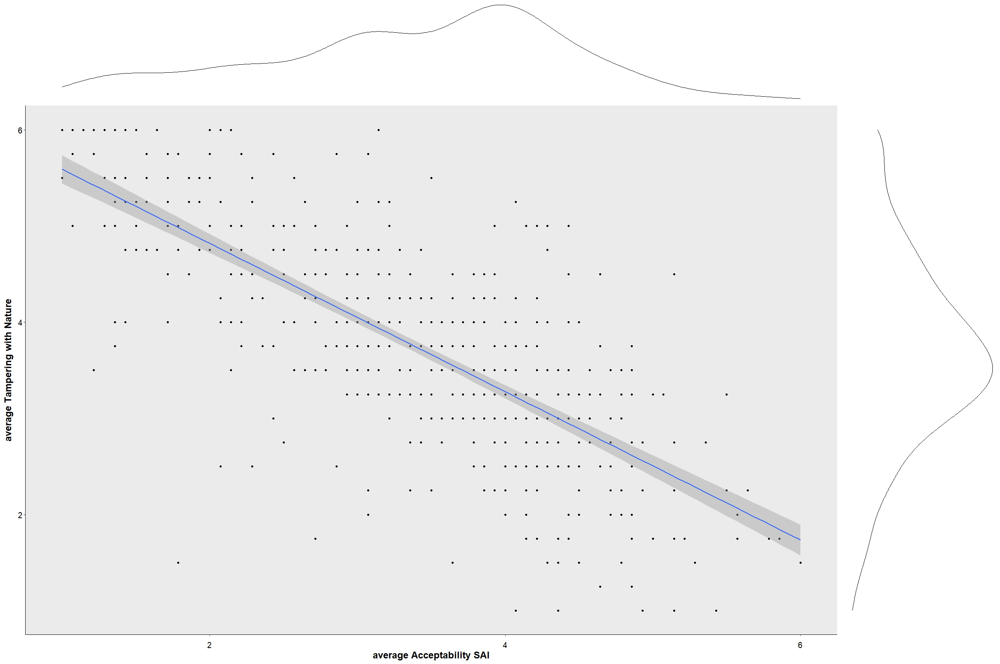
</center>

$r(577)=-.74, CI:[-.78, -71]$

]


<!-- *********** NEW SLIDE ************** -->
---
## ethical arguments regarding climate engineering technologies (CETs)

identified 21 different ethical arguments regarding CETs

<center>

</center>


<!-- *********** NEW SLIDE ************** -->
---
## multi-method approach - combining three types of data

.pull-left[


<center>

</center>


]

.pull-right[

**survey (Ethics Scale of Technology Assessment)**:
* when answering a survey scale participants only slightly differentiate between ethical theories 
  + the virtue of the developer was consistently evaluated high

**Cognitive-Affective Maps**:
* broad range of ethical arguments identified, also governance related arguments
  + linked to other predefined concepts
  + identified important arguments like "feeling that SAI mimics nature" or "brings hope"

**Open Text**:
* mainly ambivalent ethical arguments identified (“Emergency Case”, “Lesser-Evil”, “Informed Consent”)

]


<!-- *********** NEW SLIDE ************** -->
---
## the never published analysis: certainty and acceptability I

relationship between the average values of acceptability (complete scale) and the average certainty in the evaluation of the SAI technology:

<center>

</center>


* if only the linear relationship (red line) would have been considered (e.g. linear regression models) we would have concluded that less certainty in the evaluation leads to a stronger subjective rejection of the technology (slightly negative relationship)
* visible in the quadratic relation (blue line) there are groups of people who report a high certainty and a low (top left corner) or high (top right corner) acceptability of SAI


<!-- *********** NEW SLIDE ************** -->
---
## the never published analysis: certainty and acceptability II

to identify these two groups of people we applied latent class analyses on the Acceptability scale and on three items measuring the perceived certainty of the overall evaluation of the SAI technology:

<center>

</center>


* applying multiple t-tests with adjusted p-values (Bonferroni correction), we found significant mean differences on all included scales in the integrative model


<!-- *********** NEW SLIDE ************** -->
---
## future projects

*to come :-)*


<!-- *********** NEW SLIDE ************** -->
---
## References I

```{r, results='asis', echo=FALSE}
PrintBibliography(bib, start = 1, end = 5)
```


<!-- *********** NEW SLIDE ************** -->
---
## References II

```{r, results='asis', echo=FALSE}
PrintBibliography(bib, start = 6, end = 10)
```


<!-- *********** NEW SLIDE ************** -->
---
## References III

```{r, results='asis', echo=FALSE}
PrintBibliography(bib, start = 11, end = 15)
```


<!-- *********** NEW SLIDE ************** -->
---
## References IV

```{r, results='asis', echo=FALSE}
PrintBibliography(bib, start = 16, end = 20)
```


<!-- *********** NEW SLIDE ************** -->
---
## References V

```{r, results='asis', echo=FALSE}
PrintBibliography(bib, start = 21, end = 25)
```


<!-- *********** NEW SLIDE ************** -->
---
## References VI

```{r, results='asis', echo=FALSE}
PrintBibliography(bib, start = 26, end = 30)
```


<!-- *********** NEW SLIDE ************** -->
---
## References VII

```{r, results='asis', echo=FALSE}
PrintBibliography(bib, start = 31, end = length(bib))
```
